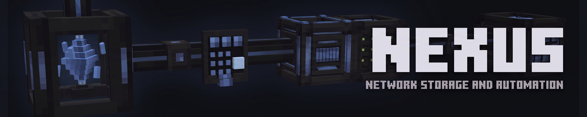

<div align="center">



# Nexus

**Network storage and automation for Minecraft.**
Build one network or many, fill it with items, fluids and energy, and let it craft, move and place things for you.


[](LICENSE)
[](LICENSE-API)

[Features](#features) · [Requirements](#requirements) · [Building](#building) · [Structure](#project-structure) · [Contributing](#contributing) · [Changelog](CHANGELOG.md)

</div>

---

## About

Everything in a Nexus network hangs off one controller, the **Nexus**. Cables carry the network, devices join it by touching a cable, and what the network holds is reached from any terminal. Nothing travels through the cables as an entity: items, fluids and FE live in the network, and devices at its edges move them in and out.

A world can hold any number of independent networks, each with its own name, color and list of people who may use it, and a network can reach across dimensions.

Nexus comes with its own way up from the first steps: a Coal Generator and a Compressor beside it make the plates that everything else is built from, then machines, metals, a network, storage and automation follow stage by stage.

## Features

### Network

- **Nexus** controller with a name and a color for its network, figures for energy and devices, and an energy tab that lists what every device draws, supplies and pays, sorted and scrollable.
- **Cables** in all 16 dye colors; cables of different colors run side by side without joining.
- **Energy** in FE: Energy Cells in four tiers and any number, five generators, and a priority that decides which source fills first and which is drawn first.
- **Work costs FE.** A device that moves something, an Assembler run and taking items out at a terminal draw from the network. A bigger network and a faster device pay more; idle devices pay nothing.
- **Wireless**: a Network Transmitter and Receiver, linked by a Network Card, carry a network between places and dimensions. A Nexus Link reaches carried terminals, up to 512 blocks with Range Upgrades, and from any distance in another dimension with a Dimension Upgrade.
- **Nexus Analyser** shows what a device does: what a Puller or Pusher moves a second with its upgrades, the work of a machine, the fuel of a generator, the crafts of an Assembler, and what each draws and supplies.
- **Access**: roles (Owner, Admin, User, Guest, Blocked) and per-player permissions, set in the Nexus. Devices work on behalf of the player who placed them.

### Power

- **Coal Generator**, **Lava Generator**, **Steam Generator**, **Biofuel Generator** and **Nether Star Generator**, each with its own model and fuel; they burn their fuel faster than a furnace and give a steady output.
- A generator or a machine works on its own beside another, without a network, so a first Compressor can run on a lone Coal Generator.

### Machines

- **Energy Furnace**, **Crusher**, **Pulverizer**, **Compressor**, **Alloy Smelter** and **Extractor**, each in four tiers (Basic, Advanced, Superior, Quantum) with more lines, speed and buffer at every tier.
- Raise a machine in place with a tier upgrade, or craft the next tier at a crafting table from the one below and its upgrade, so autocrafting can build them too.
- Sides can be set for each kind of resource; machines run on FE from the network, from a neighbour or from a pipe.

### Materials

- **Steel**, **Cobalt**, **Mithril** and **Hellsteel**: ore, raw metal, ingot, nugget, plate, dust and block, with pickaxes, axes, shovels, hoes, swords and full armor, which also work as armor trim materials.
- Alloys **Voltsteel**, **Lumen** and **Aether**, a **Nexus Crystal** found deep underground, and **Polymer** and **Biofuel** made from plants.

### Storage

- **External Vault** turns the chest beside it into the storage of the network, the first storage you can build.
- **Storage Vault** holds 16 Vault Cells and has a priority.
- **Vault Cells** for items, fluids and energy, in six sizes from 1k to 512k, each with a whitelist or blacklist filter.
- **Void Upgrade** destroys what it lists instead of storing it.

### Access

- **Terminal**, **Crafting Terminal** and **Blueprint Terminal**, mounted on a cable, with search, sorting and a resizable window.
- **Search** in every terminal: a word finds by name, `@mod` by mod, `#tag` by tag, `$text` by tooltip; `!` turns a word round, `|` means or, and parentheses and quotes group.
- **Nexus Terminal** to carry, working anywhere a Nexus Link of its network reaches. It holds a charge that opening it uses; an Energy Cell charges it, and any other item that stores FE, in its charging slot. Open it with a key (**O** by default) and switch its mode with another (**K**); it works in a hand, in the inventory or in a Curios slot.
- Recipe transfer and drag-and-drop filters through **JEI**, **REI** and **EMI**; block information in **Jade** and **The One Probe**.

### Transfer and world

- **Puller** and **Pusher** move items, fluids and FE between the network and the block they face, with filters, redstone modes, delivery order and keep-in-stock amounts.
- **Placer** and **Remover** place, drop, break and pick up in the space in front of them.
- Filters take whitelists and blacklists, tags, and looser matching that ignores wear or components.
- A **Wrench** turns a device and takes it down with its energy and fluid.

### Autocrafting

- **Blueprints** encode crafting and machine recipes, with substitutes for items of a tag.
- **Assembler** crafts on its own or hands work to any block beside it, a furnace or a machine from another mod, and Assemblers can be chained onto one machine.
- Orders from a terminal show a plan first and can craft less when something is missing. **Crafting Monitor** lists running tasks.

### Upgrades

Speed, Stack, Regulator, Capacity, Range, Dimension, Fortune, Silk Touch, Autocrafting, Chunk Loader, Efficiency, Buffer and Void, plus the three tier upgrades. Each device takes the ones that make sense for it; the Nexus and the Energy Cell take a Chunk Loader Upgrade only.

### Settings

A server config per world sets how much energy generators make, machines use and operations cost, what the carried terminal holds and costs to open, how far a Nexus Link reaches, and how many chunks one network may keep loaded.

### Languages

English, Russian, Spanish, German and French.

## Requirements

| | |
|---|---|
| Minecraft | 1.21.1 |
| NeoForge | 21.1.200 or newer (any 21.1 build) |
| Java | 21 |
| [GeckoLib](https://github.com/bernie-g/geckolib) | 4.8 or newer (4.x) |

Optional: JEI, REI or EMI add recipe transfer to the terminals; Jade and The One Probe show what a block is doing; Curios lets you carry the Nexus Terminal in any of its slots.

## Installation

Put the mod jar into the `mods` folder of a NeoForge instance and start the game.

Nexus will be published on CurseForge and Modrinth. Until then, build the jar from source as described below.

## Building

```bash
git clone https://github.com/MorphEngine69/Nexus.git
cd Nexus
./gradlew build
```

The jar is written to `build/libs`.

| Task | Does |
|---|---|
| `./gradlew build` | Compiles, runs Checkstyle and the unit tests |
| `./gradlew runClient` | Starts a development client |
| `./gradlew runServer` | Starts a development server |
| `./gradlew runGameTestServer` | Runs the in-world game tests |
| `./gradlew :nexus-network:test` | Tests one module |

## Project structure

The core is plain Java and builds and tests without Minecraft; the game code sits on top of it and is packed into a single jar.

| Module | Role | License |
|---|---|---|
| `nexus-core-api` | Shared contracts and utilities | MIT |
| `nexus-resource-api` | Resource identity, amounts and filters | MIT |
| `nexus-storage-api` | Storage contracts and composition | MIT |
| `nexus-energy-api` | Energy buffers, sources and consumers | MIT |
| `nexus-transport-api` | Transfer quotas, redstone and ordering | MIT |
| `nexus-upgrade-api` | Upgrade contracts | MIT |
| `nexus-machine-api` | Machine recipe contracts | MIT |
| `nexus-automation-api` | Blueprints, crafting plans and task states | MIT |
| `nexus-network-api` | Network, nodes, the graph and access rules | MIT |
| `nexus-network` | Network, storage, energy, machines, transfer and crafting logic | LGPL-3.0 |
| `nexus-network-test` | Test fixtures for the core | LGPL-3.0 |
| root project | Blocks, items, menus, screens and game integration | LGPL-3.0 |

New kinds of resources, storages, upgrades, machines and devices are added by registering them, without changes to the core.

## Contributing

Read [CONTRIBUTING.md](.github/CONTRIBUTING.md) first: it covers branches, commit messages, pull requests and code style. Bugs and ideas go to the [issue tracker](https://github.com/MorphEngine69/Nexus/issues).

## License

Nexus is licensed under the [LGPL-3.0](LICENSE).

The API modules (`nexus-*-api`) are licensed under the [MIT license](LICENSE-API), so addons can link against them under any license.
